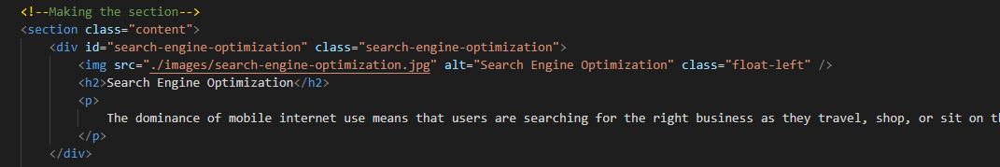
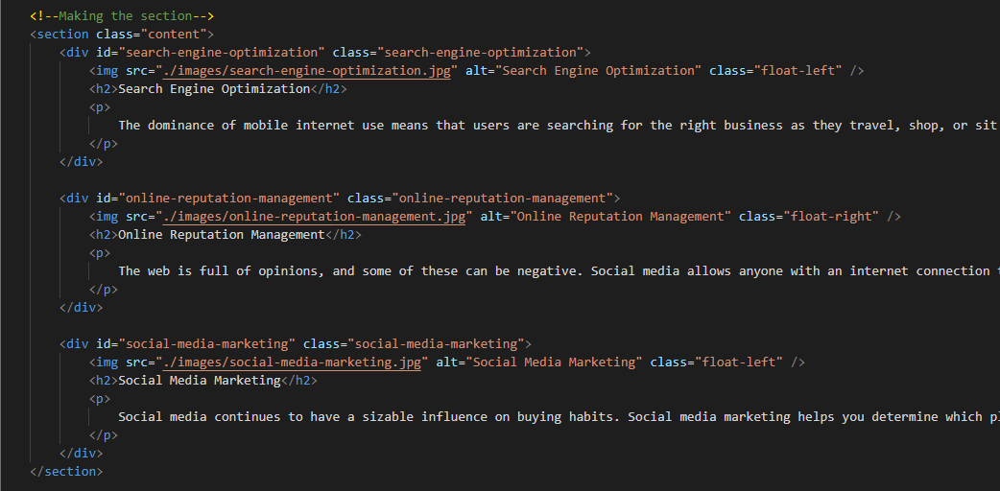
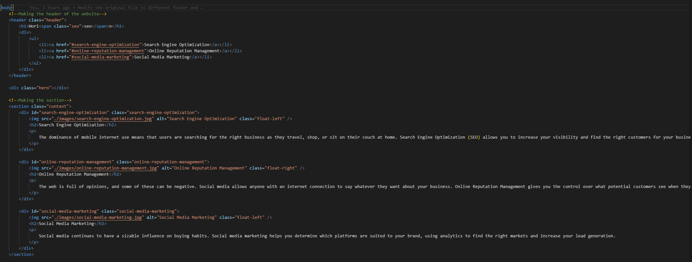
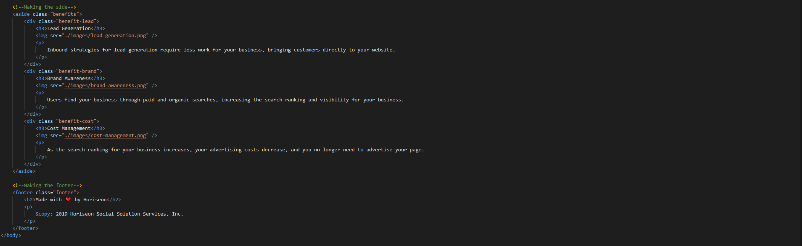
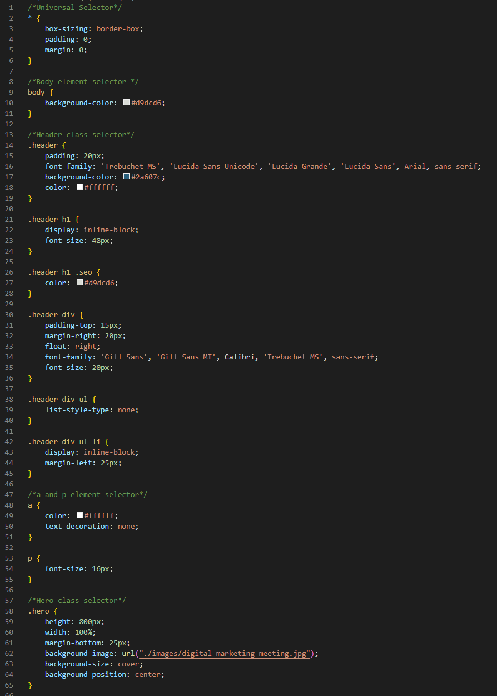
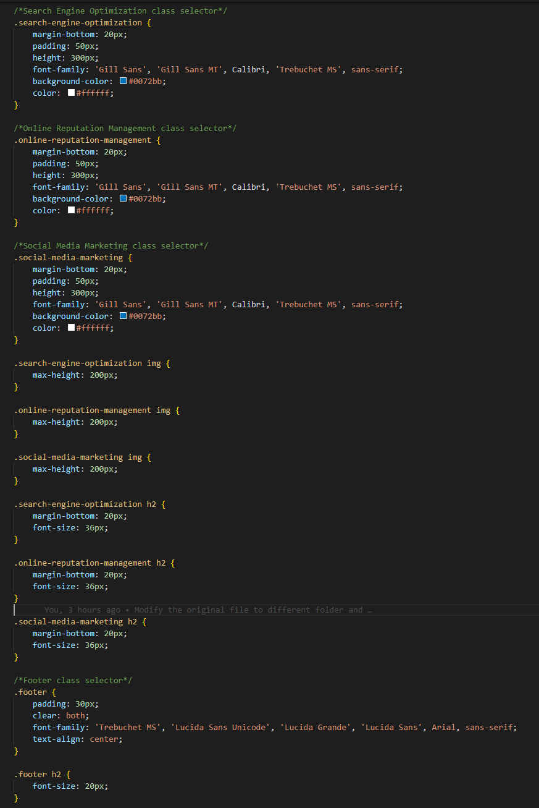

# Horiseon

## Objective
* Every week, I was given a specific homework to work on.

* This week, I was tasked to fix a certain coding mistake on the given HTML and CSS files.

* The HTML have certain issues with ID and alt problems.

* The CSS is missing the comment, so I make other harder to read.

## Acceptance Criteria
GIVEN a webpage meets accessibility standards:
* WHEN I view the source code - THEN I find semantic HTML elements

* WHEN I view the structure of the HTML elements - THEN I find that the elements follow a logical structure independent of styling and positioning

* WHEN I view the image elements - THEN I find accessible alt attributes

* WHEN I view the heading attributes - THEN they fall in sequential order

* WHEN I view the title element - THEN I find a concise, descriptive title

## Changes
1. The first thing that I changed is one of the items on the nav bar cannot connect with the content. 

2. The second thing that I changed is that I added more alt after the picture src. 

3. The third thing that I changed is that I add the semantic tags and get rid of the div.

4. The last thing that I changed is that I add the comment to make it easier to read the CSS file.

