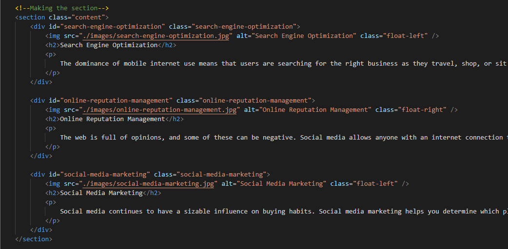
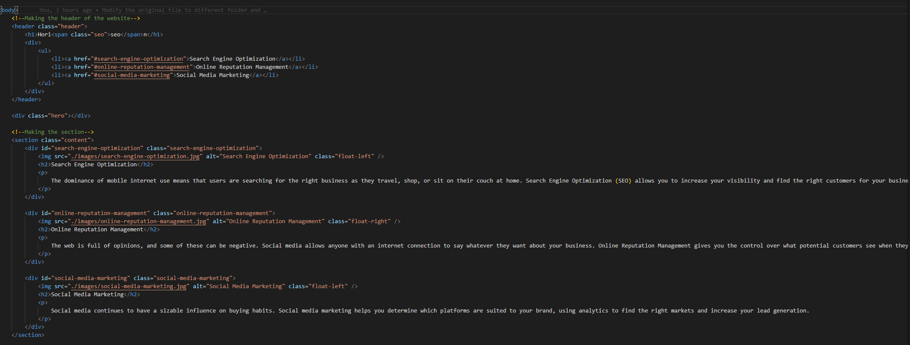
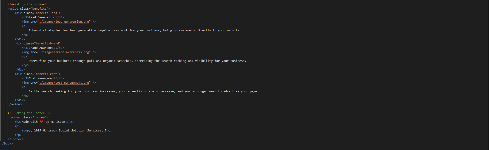
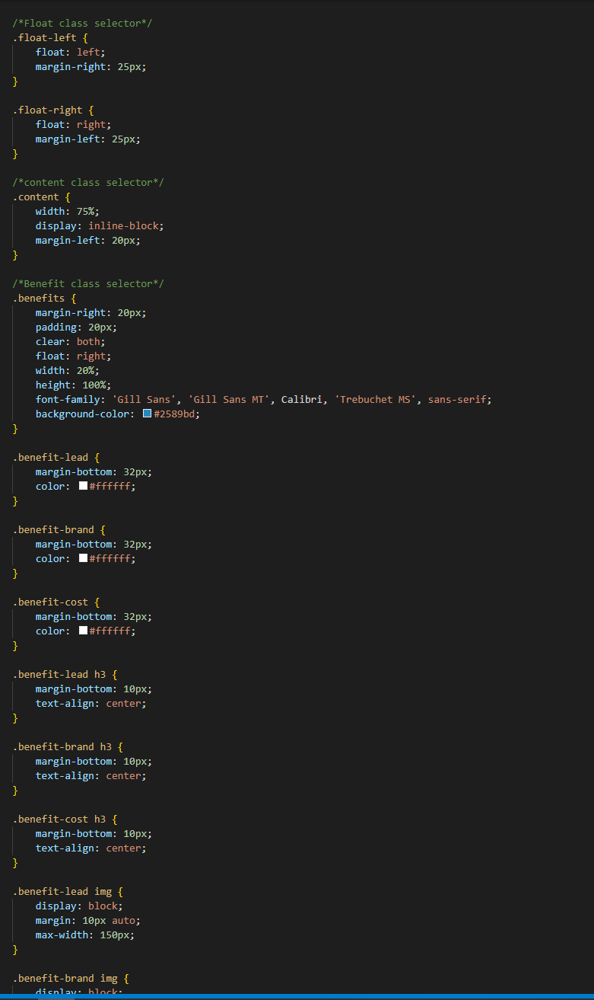
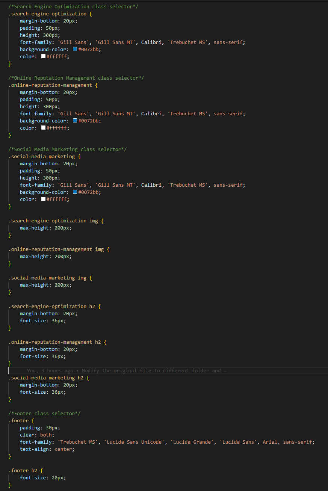

# Horiseon

## Description
Practice using Semantic Elements

## User Story
* AS A marketing agency
* I WANT a codebase that follows accessibility standards
* SO THAT our own site is optimized for search engines

## Acceptance Criteria
* GIVEN a webpage meets accessibility standards
* WHEN I view the source code
* THEN I find semantic HTML elements
* WHEN I view the structure of the HTML elements
* THEN I find that the elements follow a logical structure independent of styling and positioning
* WHEN I view the image elements
* THEN I find accessible alt attributes
* WHEN I view the heading attributes
* THEN they fall in sequential order
* WHEN I view the title element
* THEN I find a concise, descriptive title

## License

Link to the license: https://opensource.org/licenses/MIT

Permission is hereby granted, free of charge, to any person obtaining a copy
of this software and associated documentation files (the "Software"), to deal
in the Software without restriction, including without limitation the rights
to use, copy, modify, merge, publish, distribute, sublicense, and/or sell
copies of the Software, and to permit persons to whom the Software is
furnished to do so, subject to the following conditions:

The above copyright notice and this permission notice shall be included in all
copies or substantial portions of the Software.

THE SOFTWARE IS PROVIDED "AS IS", WITHOUT WARRANTY OF ANY KIND, EXPRESS OR
IMPLIED, INCLUDING BUT NOT LIMITED TO THE WARRANTIES OF MERCHANTABILITY,
FITNESS FOR A PARTICULAR PURPOSE AND NONINFRINGEMENT. IN NO EVENT SHALL THE
AUTHORS OR COPYRIGHT HOLDERS BE LIABLE FOR ANY CLAIM, DAMAGES OR OTHER
LIABILITY, WHETHER IN AN ACTION OF CONTRACT, TORT OR OTHERWISE, ARISING FROM,
OUT OF OR IN CONNECTION WITH THE SOFTWARE OR THE USE OR OTHER DEALINGS IN THE
SOFTWARE.

## Contribution
Truong Duong - https://github.com/Truong-Duong

## Results
1. The first thing that I changed is one of the items on the nav bar cannot connect with the content. 

2. The second thing that I changed is that I added more alt after the picture src. 

3. The third thing that I changed is that I add the semantic tags and get rid of the div.

4. The last thing that I changed is that I add the comment to make it easier to read the CSS file.

## Questions
You can get in touch with me through:
* Email: truong.duong1908@gmail.com
* LinkedIn: https://www.linkedin.com/in/truongduong/
* Personal website: https://txd.com/